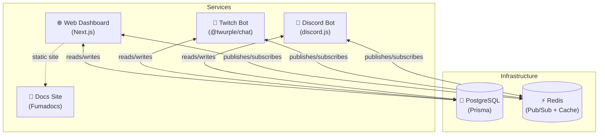
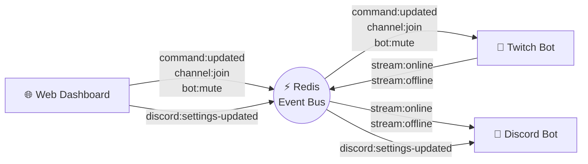
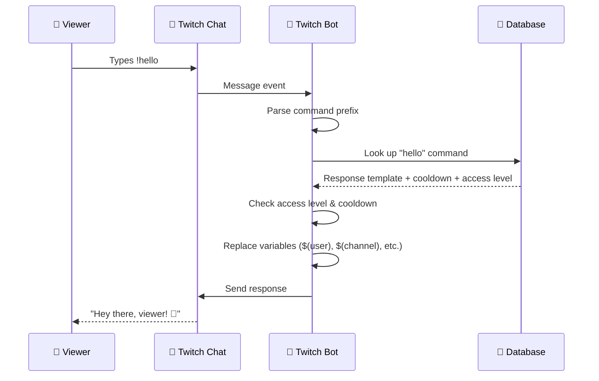
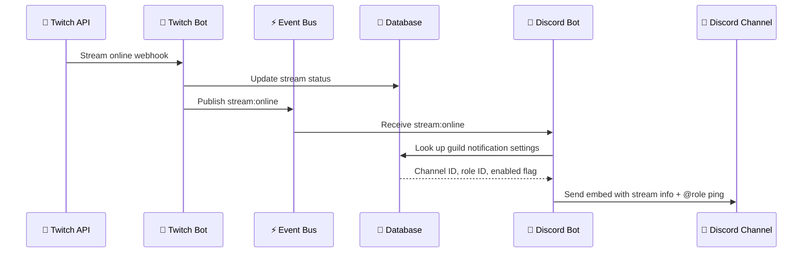
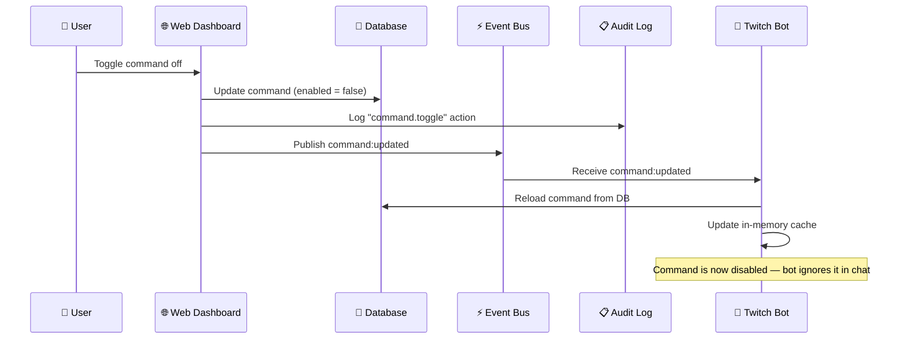
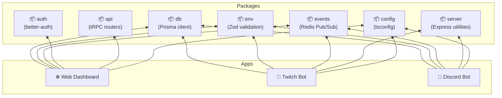

import { Callout } from "fumadocs-ui/components/callout";

<Callout title="TL;DR" type="info">
Four services (Web Dashboard, Twitch Bot, Discord Bot, Docs) share one database and talk to each other through a Redis event bus. Change something in the dashboard and the bots pick it up instantly.
</Callout>

## The Big Picture

Here's the full system at a glance — every box is a running service, every line is a connection.

<Callout title="Key takeaway" type="info">
The database is the source of truth. Redis is the messenger. Each service can run independently — if one goes down, the others keep working.
</Callout>

## Services at a Glance

| Service | What it does | Tech |
|---------|-------------|------|
| **Web Dashboard** | Manage bot settings, commands, users, and view audit logs | Next.js, tRPC, better-auth |
| **Twitch Bot** | Respond to chat commands, manage queues, moderate chat | @twurple/chat, Express API |
| **Discord Bot** | Post live stream notifications, slash commands | discord.js v14, BullMQ |
| **Docs Site** | This documentation you're reading right now | Fumadocs (Next.js) |

## How Services Talk: The Event Bus

Services don't call each other directly. Instead, they publish events to Redis and subscribe to the ones they care about.

<Callout title="Why events?" type="info">
Events are fire-and-forget. The Web Dashboard doesn't need to know *how* the Twitch Bot reloads commands — it just says "hey, commands changed" and moves on. This keeps services loosely coupled and easy to develop independently.
</Callout>

## Walk-Through: Chat Command

What happens when a viewer types `!hello` in Twitch chat?

<Callout title="Performance note" type="info">
Commands are cached in memory after first load. The bot only hits the database when it receives a `command:updated` event from the dashboard, so chat responses are fast.
</Callout>

## Walk-Through: Stream Goes Live

What happens when a monitored Twitch channel starts streaming?

## Walk-Through: Dashboard Setting Change

What happens when you toggle a command off in the web dashboard?

## Shared Packages

All services share common code through internal packages. Here's what depends on what:

| Package | Purpose |
|---------|---------|
| **db** | Prisma schema + generated client. Single source of truth for all models. |
| **env** | Zod-validated environment variables per app. Catch misconfigs at startup. |
| **events** | Type-safe Redis Pub/Sub event bus. Keeps services in sync. |
| **server** | Shared Express API server with health checks and port fallback. |
| **auth** | better-auth config for Discord + Twitch OAuth in the web dashboard. |
| **api** | tRPC routers and utilities shared by the web dashboard. |
| **config** | Base TypeScript config extended by all packages. |

## Where to Go Next

- **[Architecture](/docs/development/architecture)** — Deeper dive into the codebase structure
- **[Event Bus](/docs/development/event-bus)** — Full list of events and how to add new ones
- **[Database](/docs/development/database)** — Schema overview and migration guide
- **[Installation](/docs/getting-started/installation)** — Get the project running locally
